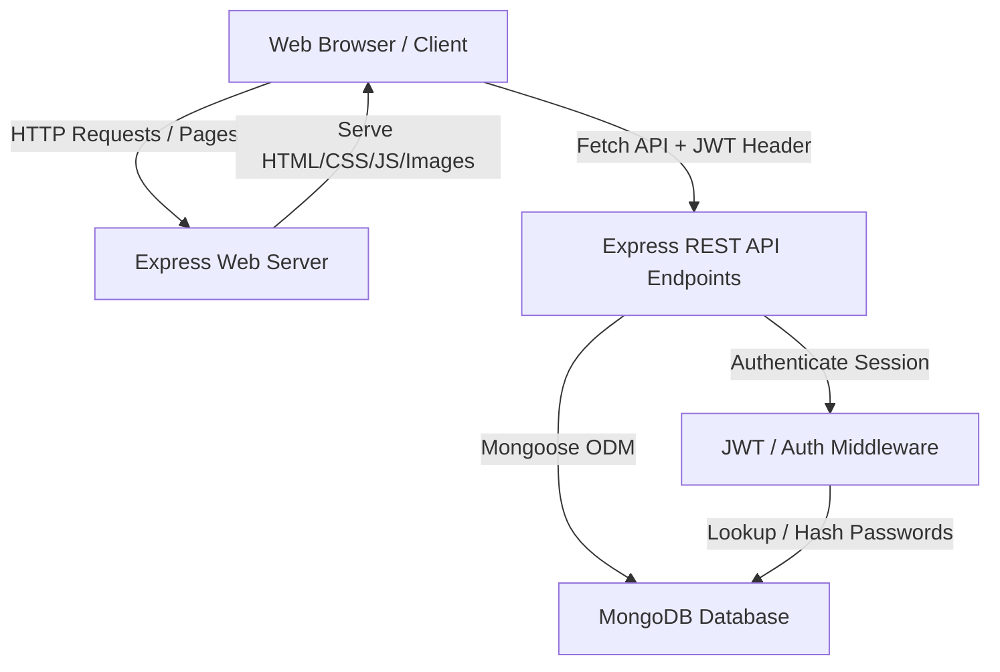
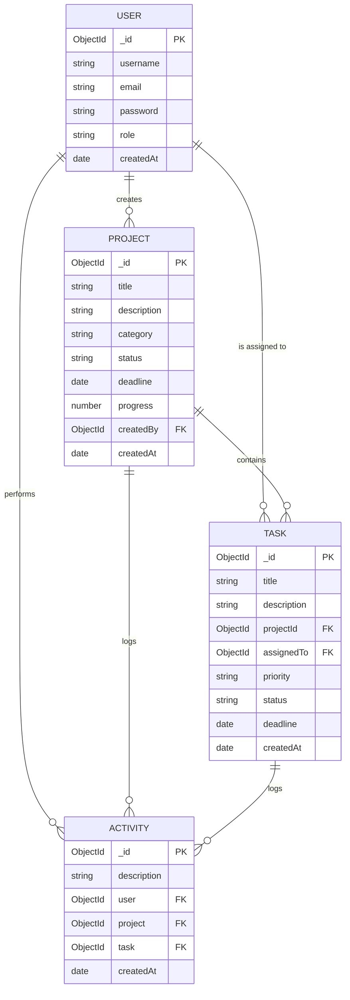
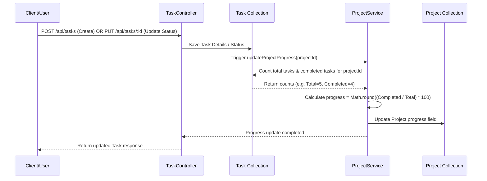
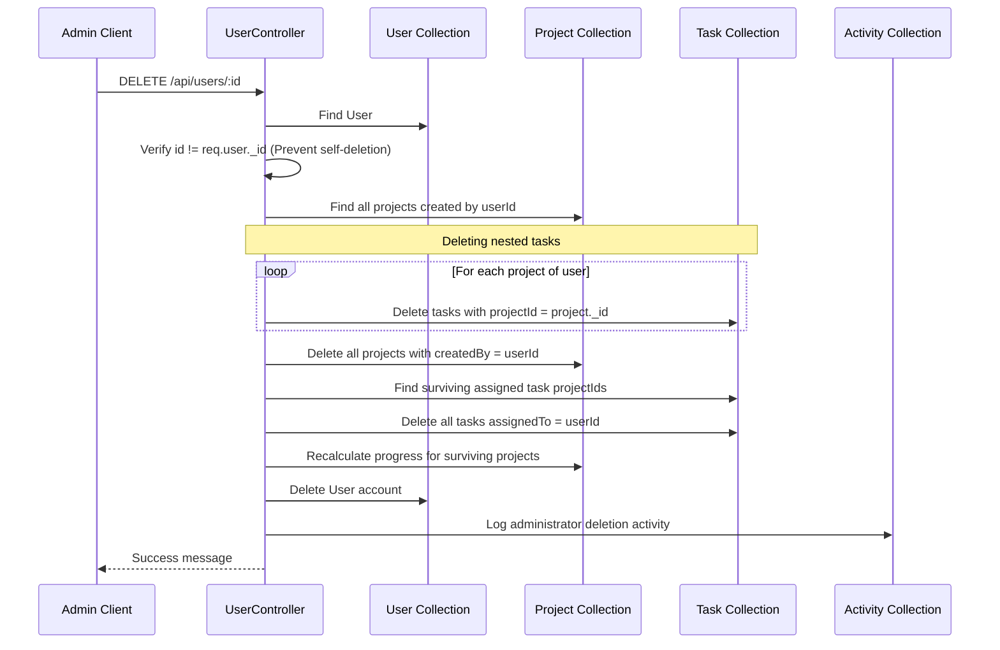

# ProjectPilot - Developer & Agent Knowledge Base (BRAIN.md)

Welcome to **ProjectPilot**, a high-fidelity, full-stack project and task management system built with Node.js, Express, MongoDB (Mongoose), and a premium glassmorphic/claymorphic frontend. 

This document serves as the absolute single source of truth for developer onboarding, architecture comprehension, API integration, styling guidelines, and operations.

---

## 1. System Architecture & High-Level Design

ProjectPilot is a traditional monolithic client-server application that uses clean URL front-end routing on top of a JSON REST API backend.



### Key Technical Stack
* **Frontend**: Vanilla HTML5, CSS3 (featuring HSL customized variables, hardware-accelerated 3D transforms, backdrop filters, and custom cubic-bezier animations), and Client JS (`api.js` request wrapper, theme toggler, and page router; `landing.js` observer-driven interactions).
* **Backend**: Node.js & Express framework.
* **Database**: MongoDB using Mongoose Object-Data Modeling (ODM).
* **Authentication**: Token-based authentication using JSON Web Tokens (JWT) stored in the browser's `localStorage` and sent via `Authorization: Bearer <token>` headers.
* **Security**: Hashed password storage using `bcryptjs` with auto-hashing on user pre-save hooks, password fields excluded by default, JWT route guards, request validation middleware, and login rate limiting.

---

## 2. Directory Layout & Repository Mapping

Below is the directory mapping for the ProjectPilot codebase:

```
C:/PRO/
├── config/
│   └── db.js                 # Database configuration & Mongoose connection handler
├── controllers/
│   ├── authController.js     # User registration, login, profile, and password update logic
│   ├── projectController.js  # Project CRUD and dashboard analytics
│   ├── taskController.js     # Task CRUD, status updates, and cascading calculations
│   └── userController.js     # Admin-only user management and administrative cascades
├── middleware/
│   ├── auth.js               # JWT extraction, signature validation, and authorization guards
│   ├── rateLimiter.js        # IP-based rate-limiter middleware
│   └── validation.js         # Input body schema validation middleware
├── models/
│   ├── Activity.js           # Mongoose Schema for system activity logs
│   ├── Project.js            # Mongoose Schema for project details and statistics
│   ├── Task.js               # Mongoose Schema for task tracker items
│   └── User.js               # Mongoose Schema for user profiles and hashed passwords
├── public/                   # Static Frontend Assets
│   ├── css/
│   │   ├── landing.css       # Layout & styling rules for Landing, Login, and Register pages
│   │   └── style.css         # Styling system for authenticated dashboard/workspace pages
│   ├── images/               # 3D illustration assets and floating background items
│   ├── js/
│   │   ├── api.js            # Frontend REST Client library, routing, and navbar renderer
│   │   └── landing.js        # Landing page animations, observers, and scroll effects
│   ├── dashboard.html        # Main dashboard displaying projects/tasks overview metrics
│   ├── index.html            # Landing / Homepage layout
│   ├── login.html            # Sign-in portal
│   ├── profile.html          # Password updater and current profile details
│   ├── project-details.html  # Project breakdown with task logs and teammates listing
│   ├── projects.html         # Projects list and creator portal
│   ├── register.html         # User signup portal
│   ├── reports.html          # Workspace reports & analytics portal
│   ├── tasks.html            # Task manager portal
│   └── users.html            # Admin-only member console
├── routes/                   # API Route Declarations
│   ├── authRoutes.js         # API routes for authentication operations
│   ├── projectRoutes.js      # API routes for projects operations
│   ├── taskRoutes.js         # API routes for tasks operations
│   └── userRoutes.js         # API routes for member directory operations
├── services/
│   └── projectService.js     # Decoupled project business logic (progress calculation)
├── .env                      # Environment configurations (Port, URI, Secrets)
├── package.json              # Express, Mongoose, and JWT library manifest
├── seed.js                   # Database seeder (cleans data and adds mock models)
└── server.js                 # Entrypoint file setting up Express server and routes
```

---

## 3. Database Schemas & Model Relationships

ProjectPilot uses Mongoose schemas to represent data structures with relationships defined by standard `Mongoose.Schema.Types.ObjectId` references.



### Schemas Details

#### 1. User Model (`models/User.js`)
* **`username`**: Unique string, trimmed, minimum 3 characters (uniquely indexed).
* **`email`**: Unique string, verified by standard email regex, lowercase (uniquely indexed).
* **`password`**: Hashed string. *Select default is false* (excluded by default from queries to prevent exposure, must be explicitly queried via `.select('+password')` where needed).
* **`role`**: Enums `['user', 'admin']`, defaults to `'user'`.
* **Signup role policy**: Public registration ignores client-submitted role values. In a fresh empty database, the first registered account becomes `admin`; all later public signups become `user`. Seed data also creates a known admin account.
* **Hooks**:
  * `pre('save')`: Evaluates if the password field is modified. If yes, hashes the password using `bcryptjs` with 10 salt rounds before saving.
* **Methods**:
  * `matchPassword(enteredPassword)`: Compares user-supplied password to the hashed database instance.

#### 2. Project Model (`models/Project.js`)
* **`title`**: String, max 100 characters, trimmed.
* **`description`**: String.
* **`category`**: String, required (e.g. Design, Development, Marketing, Operations).
* **`status`**: Enums `['planning', 'active', 'completed', 'on_hold']`, defaults to `'planning'`.
* **`deadline`**: Date, required.
* **`progress`**: Number, ranges from `0` to `100`, defaults to `0`. Represented as the percentage of completed tasks under this project.
* **`createdBy`**: ObjectId reference to User, required.

#### 3. Task Model (`models/Task.js`)
* **`title`**: String, max 100 characters, trimmed.
* **`description`**: String.
* **`projectId`**: ObjectId reference to Project, required.
* **`assignedTo`**: ObjectId reference to User, required.
* **`priority`**: Enums `['low', 'medium', 'high']`, defaults to `'medium'`.
* **`status`**: Enums `['pending', 'in_progress', 'completed']`, defaults to `'pending'`.
* **`deadline`**: Date, required.

#### 4. Activity Model (`models/Activity.js`)
* **`description`**: String, describing what occurred in the system.
* **`user`**: ObjectId reference to User, required.
* **`project`**: Optional ObjectId reference to Project (linked if activity relates to a project).
* **`task`**: Optional ObjectId reference to Task (linked if activity relates to a task).

### Database Indexes
* **User**: `username` and `email` use unique constraints, which create indexes for account lookups without duplicate manual index declarations.
* **Project**: `createdBy` is indexed for creator-based project queries and user-deletion cascades.
* **Task**: `projectId` and `assignedTo` are indexed because task lists, project details, dashboards, and cleanup flows filter by these fields constantly.

---

## 4. API Endpoints & Protection Matrix

All API endpoints are prefixed with `/api`. Authenticated endpoints require a standard JWT bearer token in the headers: `Authorization: Bearer <JWT_TOKEN>`.

| Route | Method | Access | Middleware | Controller Action | Description |
| :--- | :--- | :--- | :--- | :--- | :--- |
| `/api/auth/register` | POST | Public | `validateRegister` | `registerUser` | Creates a new user account, logs activity, returns JWT |
| `/api/auth/login` | POST | Public | `loginLimiter`, `validateLogin` | `loginUser` | Rate-limits attempts, validates credentials, logs activity, returns JWT |
| `/api/auth/me` | GET | Private | `protect` | `getMe` | Returns authenticated user details (excludes password) |
| `/api/auth/updatepassword` | PUT | Private | `protect`, `validateUpdatePassword` | `updatePassword` | Validates current password, updates to new password, logs activity |
| `/api/projects` | GET | Private | `protect` | `getProjects` | Retrieves projects supporting status/category/search/page/limit queries |
| `/api/projects` | POST | Private | `protect`, `validateProject` | `createProject` | Creates a project, logs activity |
| `/api/projects/:id` | GET | Private | `protect` | `getProjectById` | Returns project details plus all tasks nested inside it |
| `/api/projects/:id` | PUT | Private | `protect`, `validateProject` | `updateProject` | Modifies project details, logs activity |
| `/api/projects/:id` | DELETE | Private | `protect` | `deleteProject` | Cascades deletion of all nested tasks, deletes project, logs activity |
| `/api/projects/dashboard/stats`| GET | Private | `protect` | `getDashboardAnalytics`| Returns project, task, overdue, and user counts + 15 recent activities |
| `/api/tasks` | GET | Private | `protect` | `getTasks` | Retrieves tasks filtered by status/priority/projectId/assignee/search/page/limit |
| `/api/tasks` | POST | Private | `protect`, `validateTask` | `createTask` | Creates a task, recalculates project progress percentage, logs activity |
| `/api/tasks/:id` | GET | Private | `protect` | `getTaskById` | Returns a single task populated with project and assignee |
| `/api/tasks/:id` | PUT | Private | `protect`, `validateTask` | `updateTask` | Modifies task. Recalculates project progress if status or project membership changes. Logs activity. |
| `/api/tasks/:id` | DELETE | Private | `protect` | `deleteTask` | Deletes task, recalculates project progress percentage, logs activity |
| `/api/users` | GET | Private | `protect` | `getUsers` | Returns member details directory with optional page/limit pagination (excluding passwords) |
| `/api/users/:id` | DELETE | Admin | `protect`, `authorize('admin')` | `deleteUser` | Cascades deletes of user's projects/tasks/assignments, deletes user |

List endpoints (`getProjects`, `getTasks`, and `getUsers`) accept optional `page` and `limit` query parameters and return `count`, `total`, `page`, and `limit` metadata.

---

## 5. Critical System Workflows & Cascading Triggers

A modify/delete operation in ProjectPilot triggers automatic backend cascades. Altering these handlers without maintaining cascades will cause database corruption or orphaned documents.

### Workflow A: Task State Changes & Project Progress Calculation
Project progress is not set manually; it is dynamically calculated as the ratio of completed tasks to total tasks inside the project.



* **Triggers**: Progress recalculation is invoked via `updateProjectProgress` in the following events:
  * `createTask`: Adding a task changes the denominator.
  * `updateTask`: Changing a task's status to or from `'completed'` changes the numerator.
  * `deleteTask`: Deleting a task changes both numerator and denominator.
* **Transaction safety**: Task create/update/delete operations run progress recalculation inside the same MongoDB session. `updateProjectProgress` intentionally throws failures upward so the parent transaction can abort instead of committing a task change with stale project progress.
* **Risks**: Modifying or removing the progress calculation logic in this service will cause project progress to fall out of sync with task realities.

### Workflow B: Admin User Deletion & Complete Account Archival
Deleting a user account triggers a comprehensive cascading delete on the database to prevent orphaned records.



* **Cascade Steps**:
  1. Prevents self-deletion.
  2. Identifies all projects where `createdBy == userId`.
  3. Deletes all tasks nested in those projects (matching `projectId`).
  4. Deletes all projects created by that user.
  5. Captures project IDs for tasks assigned to the deleted user where the project itself survives.
  6. Deletes all tasks assigned to the user (matching `assignedTo`).
  7. Recalculates progress for surviving affected projects.
  8. Deletes the user document.
* **Transaction safety**: The account deletion flow runs inside a MongoDB transaction, including task cleanup, project cleanup, progress recalculation, user deletion, and activity logging.
* **Risks**: Disabling these cascading loops will lead to invalid references (e.g. tasks pointing to non-existent projects/users), stale project progress, or backend route population (`.populate()`) failures.

---

## 6. Client Session Management & Routing logic

The client application is completely decoupled from the server routing and handles authentication, tokens, pages, themes, and sidebar menus via `public/js/api.js`.

### Authentication Storage
* **`projectpilot_token`**: Stores the raw JWT string.
* **`projectpilot_user`**: Stores a serialized JSON object containing user metadata (`_id`, `username`, `email`, `role`).

### Page Auth Protection Matrix (`checkPageAuth()`)
On every page load, `api.js` evaluates the current browser pathname to intercept requests:
1. **Public Pages (`/`, `/login`, `/register`)**:
   * If a user is authenticated and attempts to access `/login` or `/register`, they are automatically redirected to `/dashboard`.
2. **Authenticated Pages (`/dashboard`, `/projects`, `/project-details`, `/tasks`, `/reports`, `/profile`)**:
   * If a user is not authenticated, they are automatically redirected to `/login`.
3. **Admin-Only Pages (`/users`)**:
   * If a user is authenticated but does not carry the role `'admin'`, they are redirected to `/dashboard`.

### Theme Engine (`initTheme() / toggleTheme()`)
* Stores theme state under `projectpilot_theme` in `localStorage`.
* **Dark Mode (Default)**: Class `light-mode` is absent from `body`.
* **Light Mode**: Class `light-mode` is appended to `body`, shifting global CSS custom colors.

---

## 7. Frontend Design System & Micro-Interactions

ProjectPilot features a premium glassmorphic and claymorphic theme with a responsive design layout.

### A. Color Palette Tokens (Tailored HSL Variables)
```css
:root {
  --violet: #7c5cff;
  --blue: #2563eb;
  --pink: #ff7ebb;
  --green: #10b981;
  --bg-app: #030014;         /* Sleek, deep space background */
  --panel: rgba(255, 255, 255, 0.03); /* Frosted translucent panel */
  --glass-border: rgba(255, 255, 255, 0.06);
  --ink: #ffffff;
  --muted: #8a8d9b;
}

body.light-mode {
  --bg-app: #f8fafc;
  --panel: rgba(255, 255, 255, 0.7);
  --glass-border: rgba(0, 0, 0, 0.06);
  --ink: #0f172a;
  --muted: #64748b;
}
```

### B. Element-Specific Visual Behaviors

#### 1. Landing Header and First Viewport
* **Reference layout**: `public/index.html` and `public/css/landing.css` now build the first viewport around a wide glass navbar, a large rounded hero glass panel, bold left-side copy, CTA buttons, four compact feature chips, and layered dashboard-style cards on the right.
* **Header behavior**: The landing header is intentionally `position: absolute`, not sticky. It uses one primary action, `Go to Dashboard`, and should remain visually aligned with the reference mockup rather than reverting to a login/register pair.
* **Hero constraints**: The landing hero uses responsive width caps, `overflow-x: clip`, and breakpoint-specific scaling so the first viewport feels premium without horizontal scroll.

#### 2. Interactive Card Glowing Border Effects (About Section Cards)
* **Hover Interaction**: Cards lift up slightly (`translateY(-4px)`), their top icons rotate (`rotate(6deg)`) and scale up, and text translates slightly to the right (`translateX(4px)`).
* **Border Glows**: On hover, card borders transition to an opacity of `0.6` matching their custom theme colors (purple, blue, pink, and violet) and cast a matching glowing shadow (`box-shadow: 0 0 25px var(--glow-color)`).

#### 3. Bottom CTA Section and Responsive Characters
* **HTML Structure**: Contains the main call-to-action glass card flanked by two absolute-positioned 3D peeking illustration graphics (`peeking_boy.png` on the left, `peeking_girl.png` on the right).
* **Current behavior**: `landing.js` keeps the peeking characters stable by clearing inline transforms during scroll. Hover effects remain CSS-driven on the CTA card.
* **Cursor Hover Override**: Hovering over the card bypasses the scroll position transformations using `!important` rules in `landing.css`, allowing standard cursor expansion and lift animations to run cleanly.

#### 4. Hero Section Animated Jelly Blob
* **Jelly Glow Blob**: `<div class="jelly-glow-blob"></div>` sits behind the tilted glassmorphic card visual.
* **Liquid Morph Animation**: An infinite 10-second keyframe animation (`jelly-morph`) alters the container's `border-radius`, rotation, and scale to create a shifting, organic liquid shape.
* **Glass Diffusion**: Layered behind the glass pseudo-elements (`z-index: -2` behind `::before` and `::after`), the vibrant gradient colors of the jelly blob diffuse through the glass texture, creating a lava-lamp-like glowing effect.


#### 5. Interactive 3D Flip Card System (Auth Pages)
* **Reference split layout**: `login.html` and `register.html` now share a two-column auth scene. The left `.auth-showcase` is a large rounded glass panel with the "Welcome to your organized workflow" copy, CTA buttons, floating mini dashboard cards, feature chips, and `peeking_girl.png`. The right `.auth-card-container` holds the actual login/register form card.
* **3D Flip Engine**: The `.auth-card-flipper` structure remains intact. `.auth-card-front` is the login face and `.auth-card-back` is the registration face; `.auth-card-container.flipped` still rotates the card with `rotateY(180deg)`.
* **Interactive Navigation & URL PushState**: The form footer links and the large "Get Started Free" CTA intercept clicks, toggle `.flipped`, and update the URL through `history.pushState` so the login-to-register transition remains smooth instead of feeling like a page reload.
* **Character placement**: The boy character stays pinned to the right auth form card as a static peeking accent. The old moving card-side girl is hidden because the new reference uses the girl illustration inside the left showcase panel.
* **CSS ownership**: The final `AUTH REFERENCE REDESIGN` block in `public/css/style.css` intentionally overrides older auth styles. Keep future auth visual changes in that block unless refactoring the whole auth system.

#### 6. Dashboard Reference Match
* **Dashboard shell**: `public/dashboard.html` uses `body.dashboard-page.light-mode` and the dashboard-specific CSS block in `public/css/style.css` to create the light glass reference layout.
* **Navigation**: The authenticated navbar rendered by `API.renderSidebar()` is intentionally a top horizontal glass bar. On dashboard and workspace pages it is absolute/non-sticky so it scrolls away naturally.
* **Stat icon handling**: The four dashboard stat cards reference `dashboard_total_projects.png`, `dashboard_active_projects.png`, `dashboard_completed_tasks.png`, and `dashboard_overdue_tasks.png`, with fallback images under `public/images/3d_*.png`. If an image falls back, the `fallback-icon` class is added. Keep `mix-blend-mode: normal` and the saturation/contrast filter so custom icons keep their color instead of becoming washed out.
* **Reference sizing**: The dashboard uses a four-card stat row, two middle panels, and one full-width stats breakdown panel. Keep fixed grid rhythm, stable card heights, and responsive two-column/one-column fallbacks.

#### 7. Authenticated Workspace Pages
* **Shared body class**: `projects.html`, `tasks.html`, `reports.html`, and `profile.html` use `body.workspace-page.light-mode` plus a page-specific class such as `projects-page`, `tasks-page`, `reports-page`, or `profile-page`.
* **Shared styling block**: The `PREMIUM WORKSPACE PAGES` section in `public/css/style.css` owns the common shell: light glass background, non-sticky top nav, centered content width, clean page headers, polished filters, responsive card grids, reports tables, and profile cards.
* **Dropdown fix**: Workspace selects intentionally use `appearance: auto` and remove the custom `background-image` arrow so the duplicated arrow artifacts do not return.
* **Card fit rules**: Project and task cards use `auto-fit` grids with min widths around `330px-340px` to fill available space cleanly instead of clustering on the left side.

---

## 8. Operational Management & Deployment

### Environment Configuration
The application requires a `.env` file to be created in the root directory. This file stores configuration details and sensitive credentials:
* **`PORT`**: The network port for the server to listen on (e.g. `5000`).
* **`MONGO_URI`**: The connection string for MongoDB database (e.g. `mongodb+srv://...`).
* **`JWT_SECRET`**: The secret signature key used to sign JSON Web Tokens (e.g. `supersecretkey...`).
* **`NODE_ENV`**: The running environment (e.g. `development` or `production`).

> [!WARNING]
> **Credential Exposure**: Never commit the `.env` file to version control. An explicit `.gitignore` file has been added to the root of the project to ensure this is enforced.

### Seeding the System
To clean database tables and initialize the application with pre-calculated, verified mock data (admin accounts, projects with tasks, activity logs, and status percentages), execute:
```bash
npm run seed     # or node seed.js
```

### Running Locally
To launch the Node server on localhost:
```bash
npm start        # runs node server.js on port 5000 (or process.env.PORT)
npm run dev      # runs node server.js in development mode
```

### Production Security & JWT Policies
* **JWT Expiration**: Generated tokens are configured with an expiration window of **30 days** (`30d`).
* **Token Revocation**: While client logout is handled by wiping the token from `localStorage` (`clearSession()`), to securely handle stolen or compromised tokens in production, a server-side active-token denylist stored in a fast key-value store (like Redis) or database collection should be introduced to validate incoming requests against active sessions.

---

## 9. Critical Risks & Maintenance Guidelines

If you are modifying or extending ProjectPilot, pay attention to the following risks to prevent breaking existing behaviors:

* **Secret Keys Consistency**: If you modify `JWT_SECRET` in `.env`, all active user sessions stored in client browsers will fail validation. The auth wrapper in `api.js` handles 401 exceptions by wiping the session (`clearSession()`) and redirecting to `/login`, which could cause users to get logged out unexpectedly.
* **Database Connection Resilience**: In `config/db.js`, connection failures do not crash the Node server; they log a database connection warning. This allows static landing page assets to be served even if MongoDB is offline. API endpoints are protected by `requireDatabase`, which returns a clear `503` message while MongoDB/Atlas is disconnected instead of waiting for Mongoose query buffering to time out.
* **Mongoose Population Null Checks**: Frontend controllers populate relationships (e.g. populating task assignees or project creators). If database records are modified manually without executing cascading deletions, population fields will return `null`. Always implement checks to verify that populated structures exist before accessing their properties.
* **Responsive Width Limits**: The peeking character graphic assets (`.cta-character`) are hidden at width threshold `720px` via media queries to prevent horizontal overflow on smaller screens. Maintain these media query dimensions if modifying CTA visual properties.
* **Isolated Stacking Contexts**: The `.jelly-glow-blob` and Pseudo-elements of `.device-frame` rely on an isolated stacking context (`isolation: isolate` and explicit z-index values). Ensure these z-index values (`-2` for the blob, `-1` for pseudo-elements, and `2-5` for cards) are kept in this order to preserve the frosted glass glow effect.
* **Workspace Body Classes**: Authenticated list/settings pages that should inherit the premium light shell must include `workspace-page light-mode` on `body`. Add a page-specific class when a page needs overrides, for example `projects-page` or `reports-page`.
* **Dashboard Icon Color Preservation**: Do not restore `mix-blend-mode: screen` on dashboard stat icons. The current `fallback-icon` rule intentionally keeps `mix-blend-mode: normal` with mild saturation/contrast so custom icon images remain colorful.
* **Non-Sticky Navigation**: The landing, dashboard, and workspace top bars are intentionally non-sticky/absolute in the current design direction. Preserve this unless a future requirement explicitly asks for sticky navigation.
